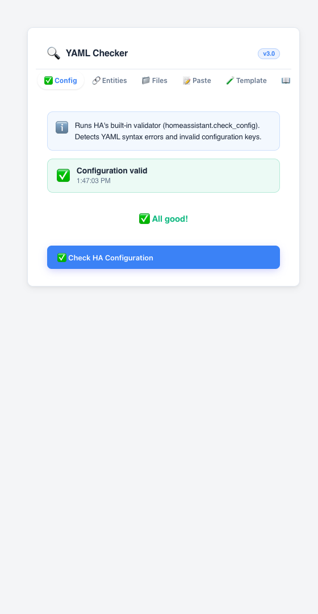
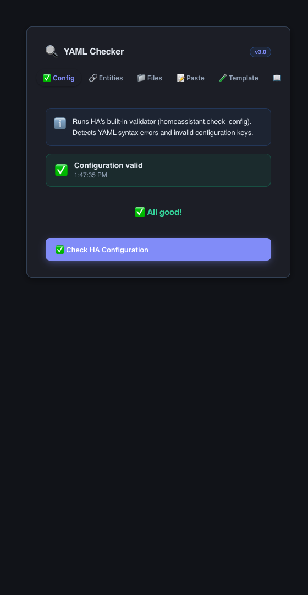

# YAML Checker


Validate Home Assistant YAML configuration from a Lovelace card — run HA's
own config check, find broken entity references in your automations and
scripts, inspect key config files, lint pasted YAML client-side, and test
Jinja2 templates. Zero configuration: add the card and every tab works
against your own running Home Assistant instance.

[](https://github.com/MacSiem/ha-yaml-checker/releases) [](LICENSE)

## How it works

**Short version: nothing runs until you click a button.** Every check is
on-demand against your live HA instance — the card holds no config options
of its own:

1. **Config Check.** Calls HA's built-in validator (`POST
   config/core/check_config`, falling back to the `homeassistant.check_config`
   service if the REST endpoint is unavailable) and shows the same
   errors/warnings HA itself would report.
2. **Entity Validator.** Reads `hass.states` plus `GET
   config/automation/config` and `GET config/script/config`, then
   cross-references every `entity_id` referenced inside automations and
   scripts against your real entities. Reports broken references, duplicate
   automation IDs, unavailable/unknown entities, missing automation
   descriptions, and dangling `script.*`/`scene.*`/`input_*` references.
3. **File Scanner.** Calls `GET config`, `GET config/entity_registry/list`,
   `GET config/device_registry/list` and `GET config/area_registry/list` for
   HA version, entity/device/area counts, config directory and component
   count, plus `GET error_log` for a rough error/warning tally. It also lists
   the key YAML files (`configuration.yaml`, `automations.yaml`,
   `scripts.yaml`, etc.) by name — their per-file status is shown as
   "unknown" because the HA REST API doesn't expose individual YAML file
   contents or checksums; this tab is a system-info summary, not a live
   file-by-file check.
4. **Paste & Validate.** Fully client-side YAML linting for anything you
   paste in — indentation/tabs, unquoted special characters, deprecated
   patterns (`data_template:`, `entity_namespace:`, `initial: on/off`, the
   HA 2024.4 `trigger:`/`condition:`/`action:` → plural key migration, and
   more). No Home Assistant call is made for this tab.
5. **Template Tester.** Sends your Jinja2 expression to `POST template` —
   the same rendering engine used by Developer Tools → Template — and shows
   the rendered result or error.
6. **Common Issues.** A static reference/cheatsheet tab (indentation,
   quoting, automations, packages, deprecated syntax, entity/template
   gotchas) — no HA call, ships with the card.

### What is automatic vs. manual

| Automatic | Manual (button click) |
|---|---|
| Tab shell renders on load; last-used tab is remembered (`localStorage` + URL hash) | Run "Check Configuration" (HA's built-in validator) |
| UI language auto-detected from the browser (PL/EN) | Run "Scan Entities" (broken refs, duplicate IDs, unavailable entities) |
| Light/dark theme follows your Home Assistant theme | Run "Scan System" (HA version, entity/device/area counts, log stats) |
| | Paste and validate arbitrary YAML |
| | Execute a Jinja2 template |

## Screenshots

| Light | Dark |
|---|---|
|  |  |

*Default view: the Config Check tab after running HA's built-in validator —
a passing result with the timestamp of the last run. Dark mode follows your
Home Assistant theme automatically.*

## Installation

1. Open HACS → Custom repositories.
2. Add `https://github.com/MacSiem/ha-yaml-checker` as category **Dashboard**
   (Lovelace plugin).
3. Install **YAML Checker** and reload your browser.

## Quick start

```yaml
type: custom:ha-yaml-checker
```

That's it — no options are required.

### Optional sidebar panel

```yaml
panel_custom:
  - name: ha-yaml-checker
    sidebar_title: YAML Checker
    sidebar_icon: mdi:home-assistant
    url_path: ha-yaml-checker
    js_url: /local/community/ha-yaml-checker/ha-yaml-checker.js
    embed_iframe: false
    config: {}
```

After restart, **YAML Checker** appears as a full-page item in the HA
sidebar instead of a dashboard card.

## FAQ

**Do I have to configure anything?**
No. Add the card and use the tabs — each check runs on demand against your
own HA instance.

**Why does the File Scanner show every config file as "unknown" status?**
Home Assistant's REST API doesn't expose the contents or validity of
individual YAML files, only aggregate info (version, entity/device/area
counts, error log). The File Scanner lists the standard files as a
reference; use the Config Check tab for an actual pass/fail validation.

**Does the Entity Validator check every entity in Home Assistant?**
It checks entity references found inside your automations and scripts
against the full list of known entities (`hass.states`), plus flags
unavailable/unknown entities and automations without a description. It
doesn't parse `scenes.yaml`, `groups.yaml` or Lovelace YAML directly.

**Does this send data anywhere?**
No. Every tab talks only to your own Home Assistant instance over the
connection your browser already has (REST endpoints such as
`config/core/check_config`, `config/automation/config`, entity/device/area
registries, and `template`). There's no telemetry, no analytics, and no
CDN-hosted fonts or scripts — the Bento CSS design system and the XSS-escape
helper are bundled inline in the single JS file. The only outbound links in
the card are the "Buy Me a Coffee" and "PayPal" support buttons, which only
fire if you click them.

## Changelog

See [CHANGELOG.md](CHANGELOG.md).

## Support

- [Buy Me a Coffee](https://buymeacoffee.com/macsiem)
- [PayPal](https://www.paypal.com/donate/?hosted_button_id=Y967H4PLRBN8W)

## License

MIT, see [LICENSE](LICENSE).
