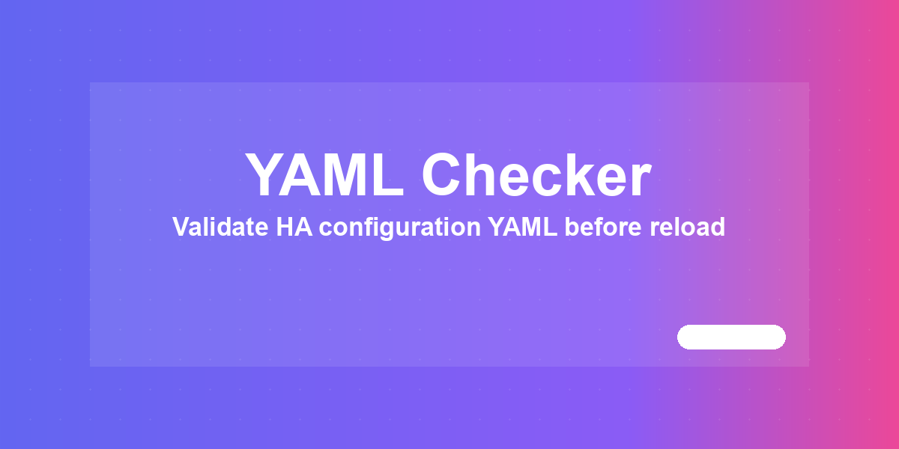

# 🗂️ YAML Checker



Validate Home Assistant YAML configuration.

[](https://www.home-assistant.io/) [](LICENSE) [](#changelog)

> Part of the [HA Tools](https://github.com/MacSiem) ecosystem — split into individual HACS-installable plugins.

## Installation (HACS)

1. Open HACS → Frontend → ⋮ → **Custom repositories**
2. Repository URL: `https://github.com/MacSiem/ha-yaml-checker` — Category: **Lovelace**
3. Install **YAML Checker** from HACS
4. Restart Home Assistant

## Usage

### Lovelace card

```yaml
type: custom:ha-yaml-checker
```

### Optional sidebar panel (`configuration.yaml`)

```yaml
panel_custom:
  - name: ha-yaml-checker
    sidebar_title: YAML Checker
    sidebar_icon: mdi:home-assistant
    url_path: ha-yaml-checker
    js_url: /local/community/ha-yaml-checker/ha-yaml-checker.js
    embed_iframe: false
    config: {}
```

After restart, **YAML Checker** appears in the HA sidebar.

## Features

- Validate Home Assistant YAML configuration.
- Bundled Bento Design System (light + dark mode, mobile-friendly)
- Self-contained — no shared HA Tools dependency
- Tool settings and dismissed-banner state are cached in browser `localStorage`
## Privacy

- No telemetry, no analytics, no tracking
- No external network calls, no CDN-hosted assets (system fonts only)
- No data leaves your device (no external network calls)
## Changelog

See [CHANGELOG.md](CHANGELOG.md).

## Support

If this tool makes your Home Assistant life easier, consider supporting development:

- [☕ Buy Me a Coffee](https://buymeacoffee.com/macsiem)
- [💳 PayPal](https://www.paypal.com/donate/?hosted_button_id=Y967H4PLRBN8W)

## License

MIT — see [LICENSE](LICENSE).
