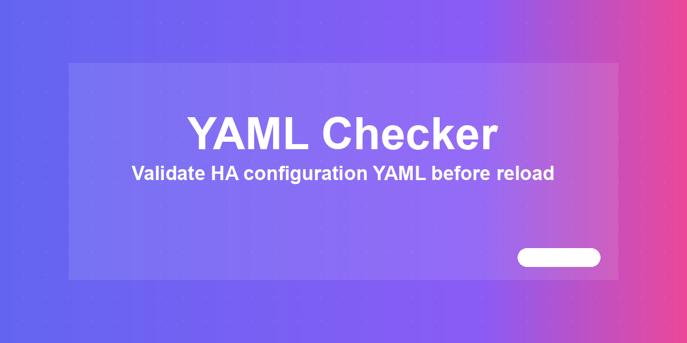
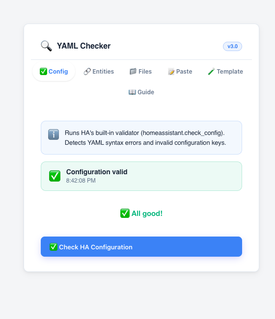
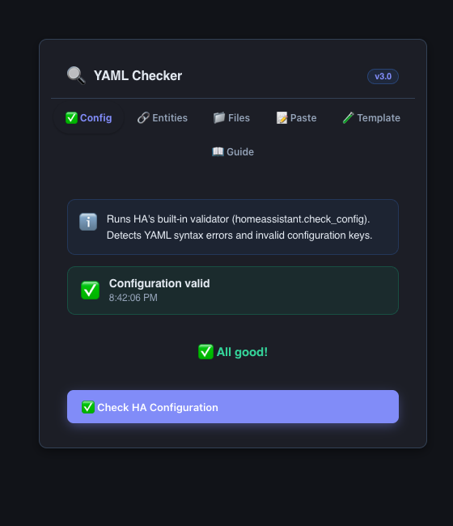

# YAML Checker



Inspect Home Assistant configuration from a Lovelace card — run HA's own
config check, find possible broken references in readable automations,
review system inventory, lint pasted YAML, and test Jinja2 templates.
The optional integration adds an administrator panel, a real parser for
pasted text, and on-demand top-level file syntax checks.

[](https://github.com/MacSiem/ha-yaml-checker/releases) [](LICENSE)

## How it works

**Short version: nothing runs until you click a button.** Every check is
on-demand against your live HA instance — the card holds no config options
of its own:

1. **Config Check.** Calls HA's built-in validator (`POST
   config/core/check_config`) and shows its result. If the call fails,
   the status is unknown; a service acknowledgement is never treated as PASS.
2. **Entity Validator.** Reads `hass.states` and the native administrator
   `automation/config` WebSocket command per automation, with bounded
   concurrency. It reports candidate references from readable automations;
   unreadable configs and script configs are marked incomplete/unsupported.
   The reference scan is heuristic, not HA's full config validation.
3. **System inventory and file syntax.** Calls `GET config` and native
   WebSocket entity, device and area registry list commands for
   HA version, entity/device/area counts, config directory and component
   count, plus `GET error_log` for a rough error/warning tally. It also lists
   the key YAML files (`configuration.yaml`, `automations.yaml`,
   `scripts.yaml`, etc.) by name. With the integration, administrators can
   parse only these allowlisted top-level files on the HA server. Each file
   gets `pass`, `fail`, or `skipped` with an error location but no content.
   `secrets.yaml` is never read. Includes are not followed; this is syntax,
   not a replacement for HA's aggregate Config Check.
4. **Paste & Validate.** Client-side heuristic advice is shown separately
   from YAML syntax. With the integration installed, an administrator can
   request syntax parsing inside HA; the parser returns only status and an
   error location, without storing or echoing pasted text. The standalone
   dashboard card marks syntax unverified.
5. **Template Tester.** Sends your Jinja2 expression to `POST template` —
   the same rendering engine used by Developer Tools → Template — and shows
   the rendered result or error.
6. **Common Issues.** A static reference/cheatsheet tab (indentation,
   quoting, automations, packages, possible legacy patterns, entity/template
   gotchas) — no HA call, ships with the card.

### What is automatic vs. manual

| Automatic | Manual (button click) |
|---|---|
| Tab shell renders on load; last-used tab is remembered (`localStorage` + URL hash) | Run "Check Configuration" (HA's built-in validator) |
| UI language auto-detected from the browser (PL/EN) | Run "Scan Entities" (broken refs, duplicate IDs, unavailable entities) |
| Light/dark theme follows your Home Assistant theme | Run "Scan System" (HA version, entity/device/area counts, log stats) |
| | Paste and validate arbitrary YAML |
| | Execute a Jinja2 template |

## Screenshots

| Light | Dark |
|---|---|
|  |  |

*Default view with a synthetic successful Config Check result and timestamp.
The card identifies HA's built-in validator. Dark mode follows your Home
Assistant theme.*

## Installation

The currently published HACS package is a Dashboard card:

1. Open HACS → Custom repositories.
2. Add `https://github.com/MacSiem/ha-yaml-checker` as category **Dashboard**.
3. Install **YAML Checker** and reload your browser.

The integration package is prepared on the development branch. For manual
development installation, copy `custom_components/ha_yaml_checker` to
`<config>/custom_components/`, restart HA, then add **YAML Checker** under
Settings → Devices & services. It registers the card and an optional
administrator sidebar panel. HACS integration installation requires the
repository category change to be accepted first.

## Quick start

```yaml
type: custom:ha-yaml-checker
```

That's it — no options are required.

### Optional sidebar panel

```yaml
panel_custom:
  - name: ha-yaml-checker
    sidebar_title: YAML Checker
    sidebar_icon: mdi:home-assistant
    url_path: ha-yaml-checker
    js_url: /local/community/ha-yaml-checker/ha-yaml-checker.js
    embed_iframe: false
    config: {}
```

After restart, **YAML Checker** appears as a full-page item in the HA
sidebar instead of a dashboard card.

## FAQ

**Do I have to configure anything?**
No. Add the card and use the tabs — each check runs on demand against your
own HA instance.

**Why does the File Scanner show every config file as "unknown" status?**
The standalone Dashboard card has no file access, so statuses are unknown.
The integration parses an allowlist of top-level files inside HA and reports
only syntax status. It never reads `secrets.yaml` or follows includes. Use
Config Check for HA's aggregate configuration validation.

**Does the Entity Validator check every entity in Home Assistant?**
It checks candidate references in automation configurations HA permits the
administrator to read against `hass.states`. Missing or unreadable configs
make the result incomplete. Script configurations are not scanned. It does
not parse `scenes.yaml`, `groups.yaml` or Lovelace YAML directly.

**Does this send data anywhere?**
No external telemetry. Calls go only to your own Home Assistant instance
over its existing connection, including `config/core/check_config`, native
registry WebSocket commands, and `template`. The integration's pasted YAML
parser runs in memory, requires administrator access, and returns no source
text. The file scanner returns only fixed filenames and syntax status. There's
no analytics, and no
CDN-hosted fonts or scripts — the Bento CSS design system and the XSS-escape
helper are bundled inline in the single JS file. The only outbound links in
the card are the "Buy Me a Coffee" and "PayPal" support buttons, which only
fire if you click them.

## Changelog

See [CHANGELOG.md](CHANGELOG.md).

## Support

- [Buy Me a Coffee](https://buymeacoffee.com/macsiem)
- [PayPal](https://www.paypal.com/donate/?hosted_button_id=Y967H4PLRBN8W)

The optional in-card support link is shown only to administrators. Dismiss it in the card or set `show_support: false` in the card configuration.

## License

MIT, see [LICENSE](LICENSE).

## Privacy and data

The card can validate pasted YAML and, with the integration, request allowed server-side configuration checks. YAML may contain credentials and private entity identifiers. Do not paste secrets into public issues; share a small synthetic example. A syntax result does not prove that every dependency or referenced entity is valid.

See [SECURITY.md](SECURITY.md) for safe vulnerability reporting and [NOTICE](NOTICE) for licensing notices.
